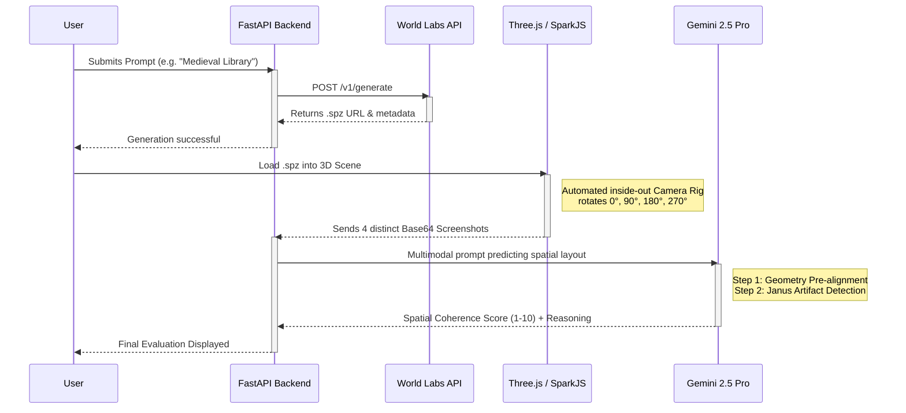

# 🌐 Auto-Eval3D — ViewFusion Spatial Coherence Evaluator

> **BigThink x World Labs Hackathon** — Best Scientific & Engineering Application Track

An automated spatial coherence evaluation pipeline that generates 3D Gaussian Splat worlds using World Labs' Marble API, programmatically captures multi-view perspectives from inside the generated meshes, and evaluates geometric consistency using Gemini 2.5 Pro with structured "ViewFusion" reasoning.

 <!-- placeholder -->

## 🧠 Theoretical Foundation

Auto-Eval3D bridges two cutting-edge 2026 research papers:

- **Think3D**: Demonstrates that spatial intelligence dramatically improves when a Vision-Language Model (VLM) actively explores a 3D environment rather than passively observing a single image.
- **ViewFusion**: Proves that VLMs fail at multi-view reasoning without a structured process separating spatial pre-alignment from question answering.

By combining Think3D's **active exploration** with ViewFusion's **structured reasoning**, Auto-Eval3D creates a fully automated spatial QA system for 3D generative AI.

## ⚡ Architecture Flow



## 🏗️ Technical Stack

| Component        | Technology                              |
|------------------|-----------------------------------------|
| **Backend Proxy**| Python 3.10+, FastAPI, Uvicorn, httpx   |
| **3D Renderer**  | THREE.js (v0.178.0), SparkJS (v0.1.10)  |
| **VLM Evaluator**| Google Gemini 2.5 Pro via Vertex AI     |
| **Generator**    | World Labs Marble 0.1 API               |
| **Database**     | SQLite (local context history)          |
| **Frontend UI**  | Vanilla JS, Custom CSS styling          |

## 🔑 Key Engineering Solutions

1. **Inside-out WebGL Capture Rig**: A critical challenge was standardizing the camera captures. Generative 3D environments produced by COLMAP use a Y-down coordinate space. We implemented a robust local-to-world transformation matrix that flips the mesh 180° around the X-axis, computes the geographic center, places the camera at `(0,0,0)` with a near clipping plane of `0.01`, and seamlessly overrides User OrbitControls to pan 360° internally.
2. **Janus Artifact Detection**: The integration reliably detects when a model generates "Janus Artifacts" (e.g. a bookshelf turning into a stone wall when viewed from the back) allowing automatic grading of the structural integrity of text-to-3D outputs.
3. **Resilient Rate-Limiter Handling**: The backend aggressively polls generation tasks using exponential backoff to handle the World Labs strict Beta rate limits transparently from the user.

## 🚀 Quick Start

### Prerequisites
- Python 3.10+
- Google Cloud SDK with Application Default Credentials
- World Labs Platform API key

### Setup

```bash
# 1. Authenticate Google Cloud (for Vertex AI)
gcloud auth application-default login

# 2. Setup Environment
cp .env.example .env
# Edit .env and enter your WLT_API_KEY

# 3. Install Python dependencies
pip install -r backend/requirements.txt

# 4. Start the server
cd backend
uvicorn main:app --reload --host 0.0.0.0 --port 8000
```
Navigate to `http://localhost:8000` in your web browser.

## 📁 Project Structure

```
autoeval3d/
├── backend/
│   ├── main.py           # FastAPI server with proxy & evaluation endpoints
│   ├── database.py       # SQLite init and paginated queries
│   └── requirements.txt  # Python dependencies
├── frontend/
│   ├── index.html        # Semantic HTML5 structure
│   ├── style.css         # Dark premium design system
│   └── app.js            # THREE.js + SparkJS + Orchestration
├── .env.example          # Template for API keys
└── README.md             # You're reading this!
```

## 📝 Inspiration & Citations
- Think3D: *Thinking with Space for Spatial Reasoning*. [arXiv 2601.13029](https://arxiv.org/html/2601.13029v3)
- ViewFusion: *Structured Spatial Thinking Chains for Multi-View Reasoning*. [arXiv 2603.06024](https://arxiv.org/html/2603.06024v1)
- [World Labs Marble API](https://docs.worldlabs.ai/api)
- Built for the BigThink x World Labs Hackathon at UMD Iribe Center.
